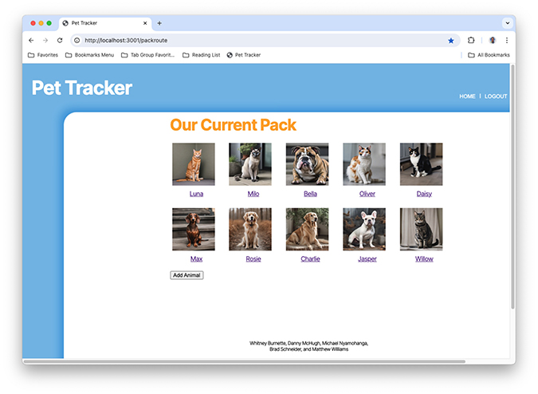
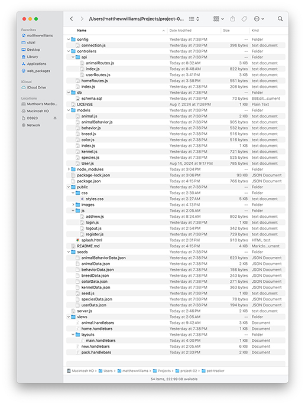
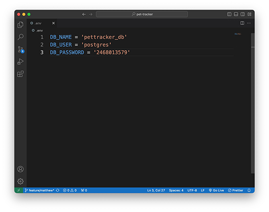

# Pet Tracker

## License

MIT License

## Description
Pet Tracker is a full-stack application that allows the staff at a pet rescue to track the animals under their care. This is a preliminary release of the app. More data points should be added prior to final release. (See [Future Development](#future-development).) An image of the central Pack page can be seen below.

## Table of Contents
- [Installation](#installation)
- [Usage](#usage)
- [License](#license)
- [Future Development](#future-development)
- [Acknowledgments](#acknowledgments)
- [Contributing](#contributing)
- [Tests](#tests)
- [Questions](#questions)

## Installation
To install the back end for Pet Tracker, download this repo being careful not to change the file and folder structure as shown in the image below.

## Usage
To use Pet Tracker, create (or edit) an .env file with your username and password. You can see an example of the structure of a .env file in the image below.

 When you have prepared your .env file, use these commands:

    npm install [installs dependences]
    psql -U postgres [opens PostgreSQL; provide your password when asked]
    \i db/schema.sql [creates the database called "pettracker_db"]
    \q to exit the PostgreSQL CLI
    node seeds/seed.js [seeds the database that was created by schema.sql]
    node server [starts the server]

In your browser, navigate to [https://pet-tracker.onrender.com/](https://pet-tracker.onrender.com/) to use Pet Tracker. You will be presented with a page from which you can log in or register a new user. All fields are required. Once logged in, you will be taken to the Pack page, a listing of all of the animals in the rescue center's care. From this central hub, you can choose to add a new animal, for which you will be presented with a form to complete, or you can click an animal's image to be taken to the details about that animal, including a photograph and a scannable QR code that can be printed and used, for example, by potential adoptees at pet-adoption events to get information about the animal. From the details page, you can delete the current animal or update its information. After adding, updating, or deleting an animal, you will be returned to the Pack page. You can also return to the Pack page by clicking the Home button in the navigation bar, and you can log out of the system by clicking on the Logout button. Logging out will return you to the login page. After five minutes of inactivity, you will be logged out automatically.

## Future Development
- A number of datapoints will need to be added for a production-quality app, including, for example, animal behavioral tendencies, a take-in date, fostering or adoption status and details, age, special dietary needs, and so on.
- In this preliminary release, the QR code can only be printed by printing or screen-shooting the animal-details page. A future release will allow users to click on the QR code to open a larger, printable version in a window of its own.
- The current structure, while functional, could be improved by setting the Pack page to be the Home page, which it already is in all but name, and setting the Login/Registration page, which is structurally the Home page in this version, to be a gateway to the Pack/Home page. The app’s logic and functionality would be enhanced by this restructuring.
- The app would benefit from a more robust responsive design. It works fine on landscape, tablet-or-larger screens, but on phones and in portrait mode, it does not provide a good user experience.

## Acknowledgments
Team members include: Whitney Burnette, Danny McHugh, Brad Schneider, and Matthew Williams. Thanks to Rene Travino for giving up a not-small part of his Saturday to help when things went awry. Thanks also to Slavic Andreev for so much attention and care, especially for spending an entire class helping with Passport.

## Contributing
To contribute to Pet Tracker, clone this repository locally and commit your code to a separate branch.

## Tests
If you are making core library changes, please write unit tests for your code and ensure that everything is working correctly before opening a pull request.

## Questions
Drop us a line at [matthewwilliamscmh@icloud.com](mailto:matthewwilliamscmh@icloud.com).
